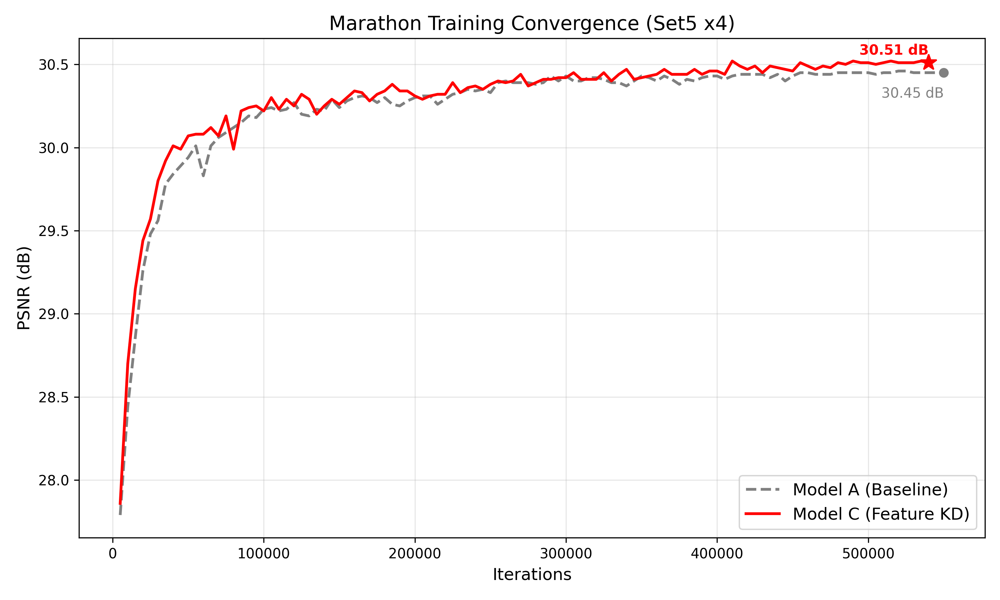
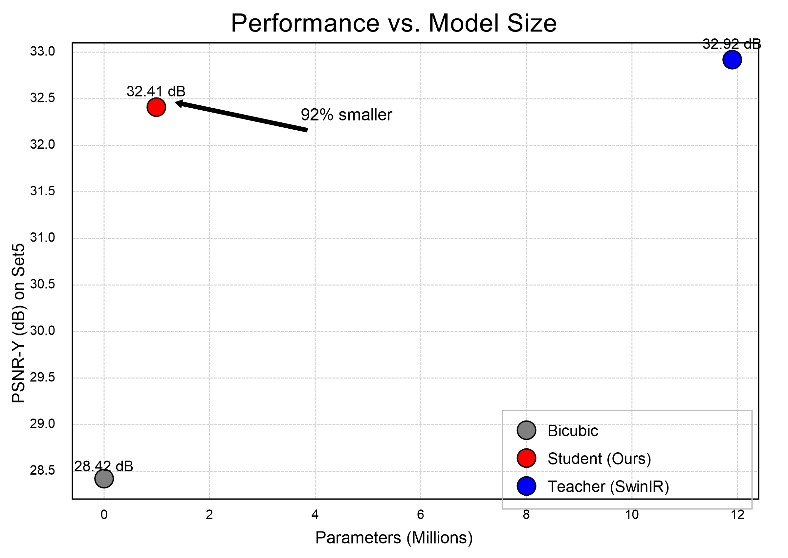
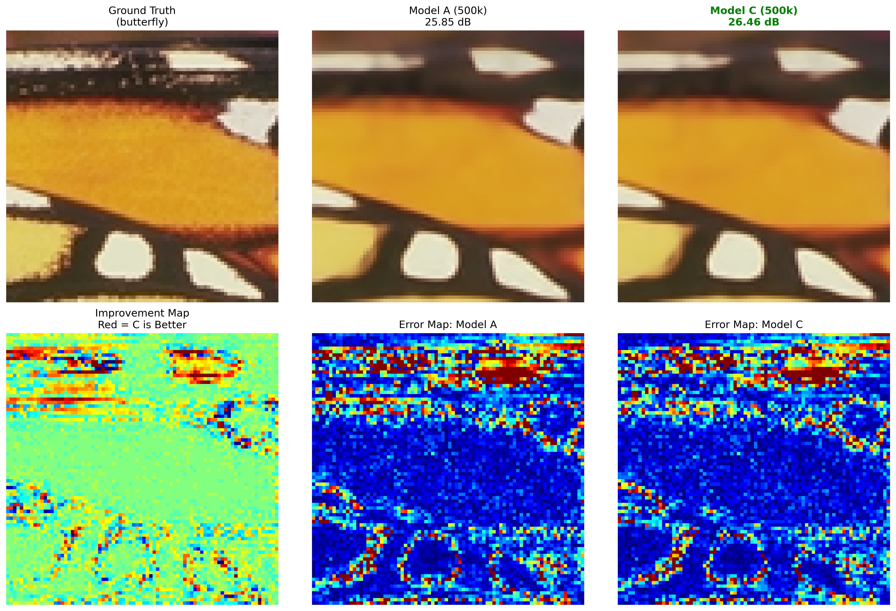

# Feature-Aware Knowledge Distillation for Lightweight SwinIR SISR

This repository contains a Big Data course project on lightweight
SwinIR-style single-image super-resolution at x4 scale. The project studies
Feature-Aware Knowledge Distillation (FAKD): a compact student is trained with
pixel loss plus intermediate feature supervision from a larger SwinIR-M teacher.

The supported result is intentionally controlled: FAKD improves a
same-capacity student over a pixel-loss-only baseline on Set5 x4 while keeping
the inference-time student architecture unchanged. This repository does not
claim broad state-of-the-art performance.


## Verified Result Summary

The checked local result uses Set5 x4:

- HR images: `testsets/Set5/HR`
- LR images: `testsets/Set5/LR_bicubic/X4`
- Baseline checkpoint: `student_weights/model_A_500k.pth`
- FAKD checkpoint: `student_weights/model_C_500k.pth`
- Teacher checkpoint: `model_zoo/swinir/001_classicalSR_DF2K_s64w8_SwinIR-M_x4.pth`

| Model | Parameters | RGB PSNR | Y PSNR | Notes |
| --- | ---: | ---: | ---: | --- |
| Baseline Student | 0.989M | 30.4532 | 32.3705 | L1-only student |
| FAKD Student | 0.989M | 30.5133 | 32.4083 | Same architecture, feature-aware KD |
| SwinIR-M Teacher | 11.900M | 30.9883 | 32.9158 | Reference teacher |

The paper-facing rounded claim is:

```text
Baseline Student: 30.45 dB
FAKD Student:     30.51 dB
Gain:             +0.06 dB
```

The 30.45/30.51 values are RGB validation-style PSNR. The saved-output
Y-channel gain is smaller but still positive: +0.0378 dB.

## Efficiency

The final checkpoint latency helper benchmarks a synthetic `1x3x64x64` LR input
patch on the same device with CUDA synchronization when CUDA is available.

| Model | Parameters | Mean latency |
| --- | ---: | ---: |
| SwinIR-M Teacher | 11.900M | 40.13 ms |
| FAKD Student | 0.989M | 19.70 ms |
| Baseline Student | 0.989M | 20.28 ms |

On the local NVIDIA GeForce RTX 4060 Laptop GPU, the FAKD student is 2.04x
faster than the teacher with a 50.91% latency reduction. Latency is
hardware-dependent; cite the device and benchmark protocol with the numbers.


## Training Dynamics

The final 500k training logs show the controlled same-backbone comparison
between the baseline student and FAKD student.



## Performance vs Size

The FAKD student keeps the same compact architecture as the baseline student and
improves Set5 x4 RGB PSNR by +0.06 dB in the verified protocol.



## Visual Evidence

The visual comparison script loads the final 500k student checkpoints and Set5
x4 images directly. It does not require pre-existing `results/` folders.

The example below is representative evidence only; the table metrics above are
the main reproducible result.



## Reproducibility

Use the no-save helpers for paper numbers:

```powershell
D:\Conda_Envs\swinir\python.exe scripts\reproduce_set5_metrics.py students-rgb
D:\Conda_Envs\swinir\python.exe scripts\reproduce_set5_metrics.py saved-results
D:\Conda_Envs\swinir\python.exe scripts\reproduce_set5_metrics.py teacher
D:\Conda_Envs\swinir\python.exe scripts\reproduce_set5_metrics.py params
D:\Conda_Envs\swinir\python.exe scripts\benchmark_final_checkpoints.py
```

Full protocol notes, expected outputs, and caveats are in
[`docs/reproducibility_set5.md`](docs/reproducibility_set5.md).

## Regenerating Figures

```powershell
D:\Conda_Envs\swinir\python.exe scripts\plot_results.py
D:\Conda_Envs\swinir\python.exe scripts\plot_marathon_convergence.py
D:\Conda_Envs\swinir\python.exe scripts\plot_visuals.py
```

## Project Layout

- `main_train_student.py`: training entry point for student experiments.
- `main_test_student.py`: student evaluation script; writes images to `results/`.
- `main_test_swinir.py`: teacher evaluation script; use patch size 64 for the local x4 teacher.
- `scripts/reproduce_set5_metrics.py`: no-save metric and parameter helper.
- `scripts/benchmark_final_checkpoints.py`: no-save final-checkpoint latency helper.
- `options/swinir/train_swinir_student_500k_A.json`: final baseline 500k config.
- `options/swinir/train_swinir_student_500k.json`: final FAKD 500k config.

## Acknowledgements

This work builds on the official SwinIR and KAIR repositories. The project code
is a course-specific fork focused on reproducible lightweight-student
experiments.
