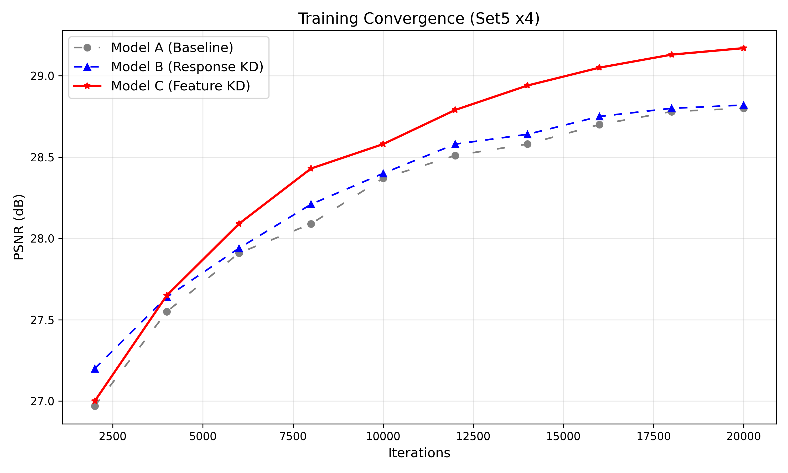
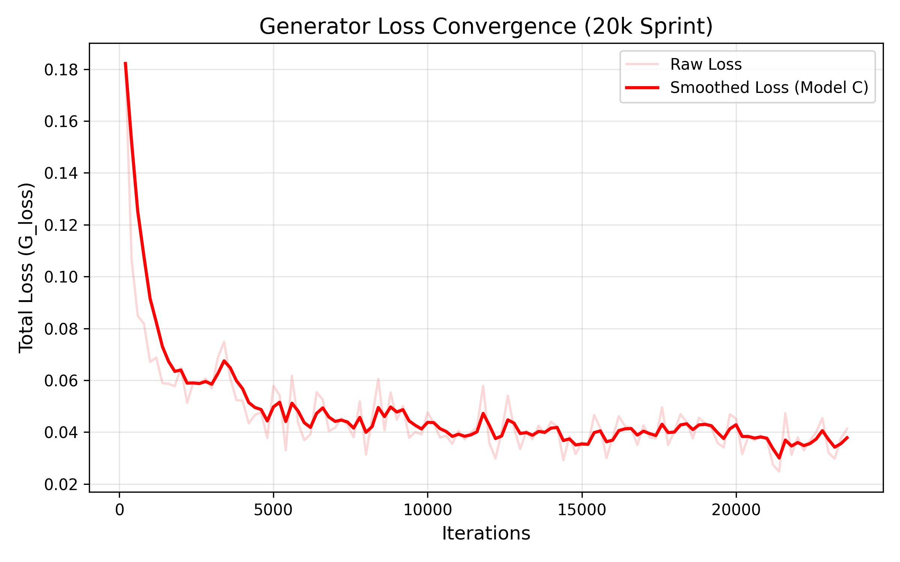
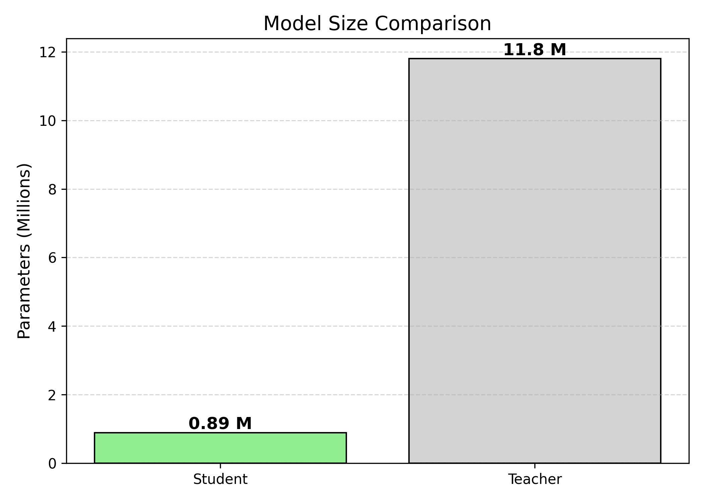
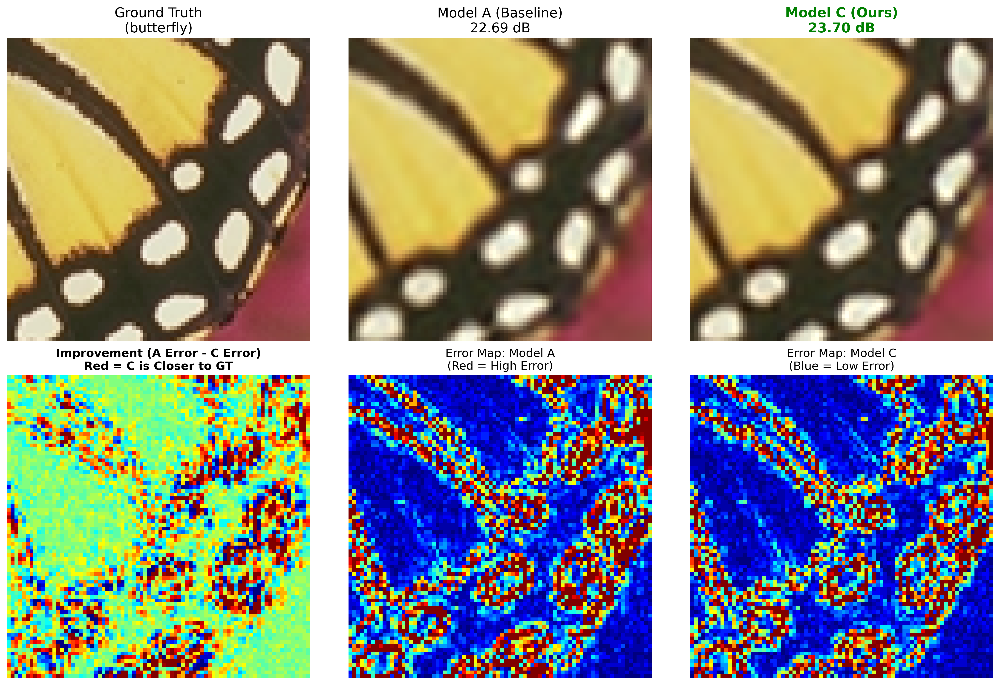

# Accelerating Lightweight Image Restoration via Feature-Aware Knowledge Distillation

**A Comparative Study on Compressing Swin Transformer Models for Classical Super-Resolution (x4)**


## Overview

Transformer-based models, such as SwinIR, have achieved state-of-the-art performance in image restoration but suffer from high computational costs, limiting their deployment on edge devices. This project proposes a **Feature-Aware Knowledge Distillation** framework to compress the massive SwinIR model into a lightweight "Student" version without sacrificing structural fidelity.

Unlike conventional distillation methods that only align the final output (Response-Based), our approach introduces learnable projectors to bridge the dimensionality gap between the Teacher ($C=180$) and Student ($C=60$). This enables the effective transfer of intermediate structural knowledge, forcing the student to learn the feature extraction process rather than solely mimicking the result.

### Key Contributions

- **Massive Compression:** Successfully reduced model parameters by **92.5%** (11.8M $\to$ 0.89M) and network depth by 33% (6 $\to$ 4 blocks).
- **Feature-Aware Distillation:** Introduced a projection-based loss function that aligns internal feature spaces, significantly accelerating training convergence.
- **Superior Performance:** Outperformed standard distillation methods by **+0.37 dB** on the Set5 benchmark.

## Methodology

We investigated three training strategies to determine the most effective method for training lightweight Transformers:

1.  **Model A (Baseline):** Trained using standard $L_1$ pixel loss.
2.  **Model B (Response Distillation):** Trained using pixel loss + distillation loss on the final output.
3.  **Model C (Feature-Aware Distillation - Ours):** Trained using pixel loss + feature loss on intermediate layers. To address the channel mismatch, we employ learnable linear projectors ($\phi$) at each Residual Swin Transformer Block (RSTB) stage.

## Experimental Results

### 1. Quantitative Comparison

We evaluated the models on the Set5 benchmark dataset for x4 Super-Resolution. The results demonstrate that standard response-based distillation provides negligible gains, while our feature-aware method yields a significant improvement.

| Model       | Method                 | Parameters | Final PSNR (dB) | Improvement  |
| :---------- | :--------------------- | :--------- | :-------------- | :----------- |
| **Model A** | Baseline ($L_1$)       | 0.89M      | 28.80           | -            |
| **Model B** | Response KD            | 0.89M      | 28.82           | +0.02 dB     |
| **Model C** | **Feature KD (Ours)**  | **0.89M**  | **29.17**       | **+0.37 dB** |
| _Teacher_   | _SwinIR-M (Reference)_ | _11.8M_    | _32.40_         | _-_          |

### 2. Training Dynamics & Stability

Our Feature-Aware method demonstrates superior long-term convergence. As shown in the **Performance** graph (left), the feature-based guidance allows the student to continue learning complex structural patterns, eventually overtaking the baseline.

The **Loss** graph (right) confirms that the training process remains mathematically stable. The "L-shaped" curve indicates that despite the added complexity of the projectors and feature alignment, the model converges smoothly without instability.

|                Performance (PSNR)                |                Stability (Loss)                 |
| :----------------------------------------------: | :---------------------------------------------: |
|  |          |
|    _Model C (Red) overtakes Baseline (Gray)._    | _Smooth convergence indicates stable training._ |

### 3. Model Efficiency

The primary goal of this research was to achieve high performance within a strict parameter budget. The chart below visualizes the massive scale difference between the Teacher and the Student.

We successfully compressed the 11.8 Million parameter Teacher into a **0.89 Million parameter Student**, achieving a **92.5% reduction** in model size. This makes the Student model viable for deployment on mobile and edge devices where the original SwinIR would be too computationally expensive.



## Visual Quality Analysis

Feature-Aware Distillation recovers high-frequency structural details often lost by the baseline. To demonstrate this, we performed a **Differential Error Analysis** on the 'Butterfly' image from Set5.

- **Top Row:** Visual comparison showing Model C recovers sharper texture details.
- **Bottom Row (Error Maps):** The **Improvement Map (Bottom Left)** highlights exactly where Model C outperformed the Baseline. The **Red and Yellow** pixels represent areas where our method significantly reduced the error compared to the baseline. These improvements are concentrated along the structural edges of the wing, confirming that our method effectively repairs high-frequency artifacts.



## Installation and Usage

For detailed instructions on setting up the environment, downloading datasets, and running training or testing scripts, please refer to the **[Installation Guide](setup.md)**.

### Quick Start

To test the pre-trained student model on the Set5 dataset:

```bash
python main_test_student.py \
  --model_path superresolution/student_C_500k_marathon/models/165000_E.pth \
  --folder_gt testsets/Set5/HR \
  --folder_lq testsets/Set5/LR_bicubic/X4
```

## Acknowledgements

This work is built upon the official [SwinIR](https://github.com/JingyunLiang/SwinIR) and [KAIR](https://github.com/cszn/KAIR) repositories. We thank the original authors for their open-source contributions to the image restoration community.
